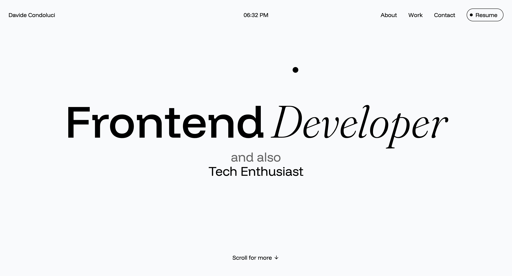

# Davide Condoluci - Personal Website  

  

## 📌 Overview  
This is my personal portfolio website, showcasing my projects, skills, and professional background. Built with modern web technologies, it serves as my digital hub for work and contact.  

🔗 **Live Site:** [https://davidecondoluci.com](https://davidecondoluci.com)  

## 🛠️ Technologies Used  
- **Frontend:** React, JavaScript, HTML5, CSS3  
- **Styling:** Tailwind CSS  
- **Hosting:** Vercel  
- **Tools:** ESLint, PostCSS  

## 🚀 Features  
- ✅ Responsive design (mobile-friendly)
- ✅ About Me section
- ✅ Interactive project showcase
- ✅ Contact form
- ✅ Dynamic components (e.g., animated effects)

## 📂 Project Structure  
```bash
DAVIDECONDOLUCI.COM/
├── public/                  # Static files (HTML, images, PDFs)
│   ├── img/                 # Images
│   │   ├── covers/          # Project/blog covers
│   │   ├── icons/           # Icons (SVG, favicon)
│   │   └── screens/         # Project screenshots
│   ├── pdf/                 # PDF documents (CV, portfolio)
│   └── index.html           # HTML entry point
│
├── src/                     # Core source code
│   ├── assets/fonts/        # Font files
│   ├── components/          # Reusable React components
│   │   ├── CodeEffect.jsx   # Dynamic text animations
│   │   ├── Logo.jsx         # Logo component
│   │   ├── Navbar.jsx       # Navigation bar
│   │   └── Popup.jsx        # Modals/popups
│   │
│   ├── data/                # Structured data (JSON)
│   │   ├── projects.json    # Projects list
│   │   └── skills.json      # Skills/abilities
│   │
│   ├── pages/               # Main site pages
│   │   ├── About.jsx        # About Me page
│   │   ├── Contact.jsx      # Contact page
│   │   ├── Home.jsx         # Homepage
│   │   └── Work.jsx         # Projects page
│   │
│   ├── App.css              # Global styles
│   ├── App.jsx              # Root component
│   └── main.jsx             # React rendering
│
├── .vscode/                 # IDE configurations
├── node_modules/            # npm dependencies
├── .eslintrc.cjs            # ESLint config
├── .gitignore               # Git ignored files
├── package.json             # Dependencies and scripts
├── package-lock.json        # Dependency versions
├── postcss.config.js        # PostCSS config
├── tailwind.config.js       # Tailwind config
├── vercel.json              # Vercel deployment config
└── README.md                # Project documentation
```

## 🛠️ Setup & Deployment  
1. **Clone the repository:**  
   ```bash
   git clone https://github.com/your-username/davidecondoluci.com.git
   ```
2. **Install dependencies:**  
   ```bash
   npm install
   ```
3. **Run locally:**  
   ```bash
   npm run dev
   ```
4. **Deploy to Vercel:**  
   - Push changes to `main` branch (Vercel auto-deploys).  

## 📬 Contact  
Let’s connect!  
- ✉️ Email: [davide.condoluci1@gmail.com](mailto:davide.condoluci1@example.com)  
- 💼 LinkedIn: [davide_condoluci](https://linkedin.com/in/davide_condoluci)  
- 🌐 Website: [https://davidecondoluci.com](https://davidecondoluci.com)  

## 📜 License  
Open-source under the [MIT License](LICENSE).  

--- 

⭐ **Star this repo if you find it useful!** Feedback is welcome.
