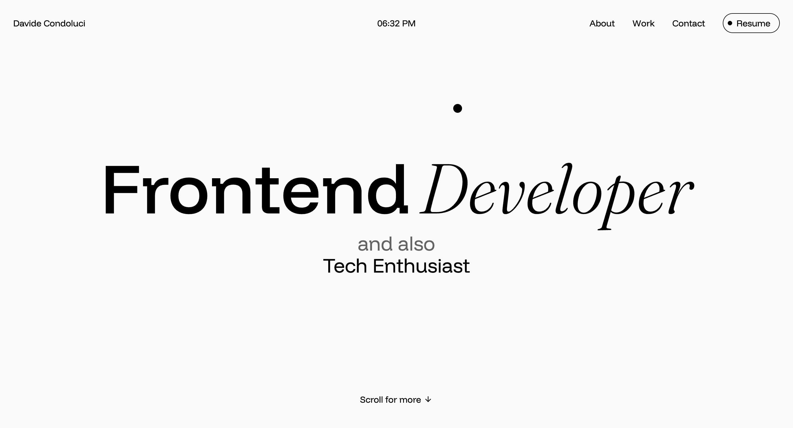

# davidecondoluci.com

Personal portfolio website — built with React, Vite, and Tailwind CSS.

🔗 **Live:** [https://davidecondoluci.com](https://davidecondoluci.com)



---

## Tech Stack

| Layer         | Technology                 |
| ------------- | -------------------------- |
| Framework     | React 18 + React Router v6 |
| Build tool    | Vite                       |
| Styling       | Tailwind CSS               |
| Animations    | GSAP                       |
| Smooth scroll | Lenis                      |
| Icons         | Google                     |
| Hosting       | Vercel                     |

---

## Project Structure

```
davidecondoluci.com/
├── public/
│   ├── img/
│   │   ├── covers/          # Project cover images
│   │   └── icons/           # Icons and favicon
│   └── pdf/                 # CV and other documents
│
├── src/
│   ├── assets/fonts/        # Custom fonts
│   ├── components/
│   │   ├── FlipLink.jsx     # Animated flip-text link
│   │   ├── Loader.jsx       # Page loader
│   │   └── Navbar.jsx       # Navigation bar
│   ├── data/
│   │   └── projects.json    # Projects data
│   ├── pages/
│   │   ├── Hero.jsx         # Landing / hero section
│   │   ├── About.jsx        # About me
│   │   ├── Work.jsx         # Projects showcase
│   │   └── Contact.jsx      # Contact section
│   ├── App.jsx              # Root component & routing
│   ├── App.css              # Global styles
│   └── main.jsx             # React entry point
│
├── index.html
├── vite.config.js
├── tailwind.config.js
├── postcss.config.js
├── vercel.json
└── package.json
```

---

## Getting Started

```bash
# Install dependencies
npm install

# Start dev server
npm run dev

# Build for production
npm run build

# Preview production build
npm run preview
```

---

## Deployment

The site is deployed on **Vercel**. Every push to the `main` branch triggers an automatic deployment.

---

## Contact

- Email: [davide.condoluci1@gmail.com](mailto:davide.condoluci1@gmail.com)
- LinkedIn: [linkedin.com/in/davide_condoluci](https://linkedin.com/in/davide_condoluci)
- Website: [davidecondoluci.com](https://davidecondoluci.com)
